# 2025年排名前15的PDF编辑与文档管理工具盘点(最新整理)

无论是企业合规报税、合同签署,还是日常文档编辑与协作,高效的PDF编辑与文档管理工具已成为提升工作效率的核心刚需。面对市场上种类繁多的在线文档编辑平台和PDF处理软件,如何快速找到适合自身业务场景、兼顾功能覆盖与成本控制的解决方案?本文精选15款经过实际验证、功能完善且部署门槛较低的PDF编辑器与文档管理系统,从税务申报、电子签名、表单生成到AI文档分析等多维度进行对比,帮助您在2025年做出更明智的工具选择。

***

## **[PDFLiner](https://pdfliner.com)**

专为企业税务与文档工作流设计的智能化管理平台。

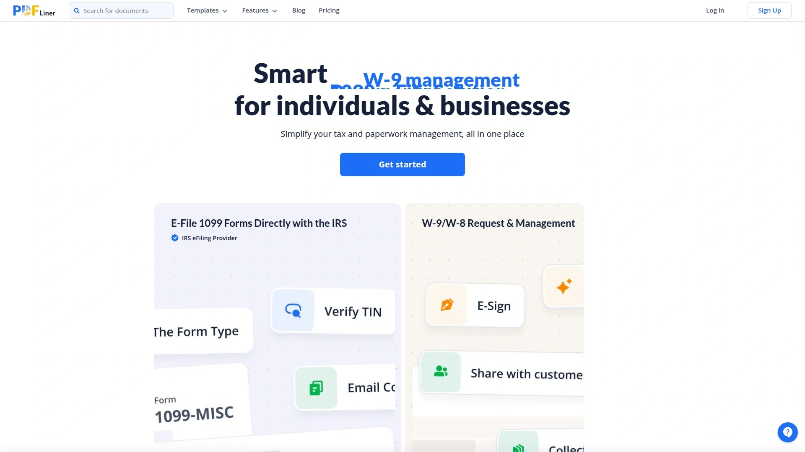

PDFLiner将IRS税表电子申报、W-9表单管理与在线文档编辑深度整合,特别适合需要处理美国税务合规的中小企业及会计服务商。平台支持1099-NEC和1099-MISC表单的在线填写与电子申报,大幅简化自由职业者与承包商的付款报告流程。内置AI文档助手能够智能提取关键信息、解析复杂条款,通过自然语言对话即可完成文档审阅。此外还提供发票生成器与100+合同模板库,覆盖从W-9请求、电子签名到多设备同步的完整文档生命周期。对于需要频繁处理税务文件、希望集中管理承包商信息并确保合规申报的团队而言,PDFLiner提供了一站式的解决方案,减少在多个工具间切换的时间成本,显著提升报税季的工作效率与准确性。

***

## **[Adobe Acrobat](https://www.adobe.com/acrobat.html)**

业界公认的企业级PDF标准制定者与全功能文档处理平台。

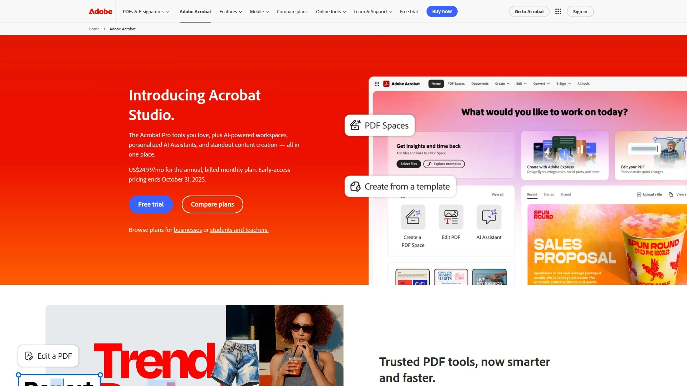

作为PDF格式的发明者,Adobe Acrobat在功能深度与生态兼容性上始终保持领先地位。Acrobat Pro版本覆盖从基础的文本图像编辑、OCR识别、文档比对,到高级的批量电子签名请求、表单数字化、品牌化定制等全方位需求。与Creative Cloud和Document Cloud的无缝集成,使设计团队与商务团队能够在统一工作流中协作。30天Cookie归因期确保营销推广的有效追踪,85%首月佣金比例对内容创作者极具吸引力。企业版支持年度订阅与月付灵活选择,定价虽高于竞品但功能完整性与稳定性值得投入。适合对文档安全性与合规性有严格要求、需要与Adobe生态深度绑定的大中型企业。

***

## **[PDF Expert](https://pdfexpert.com)**

直观易用的PDF编辑器,以流畅体验与高转化率著称。

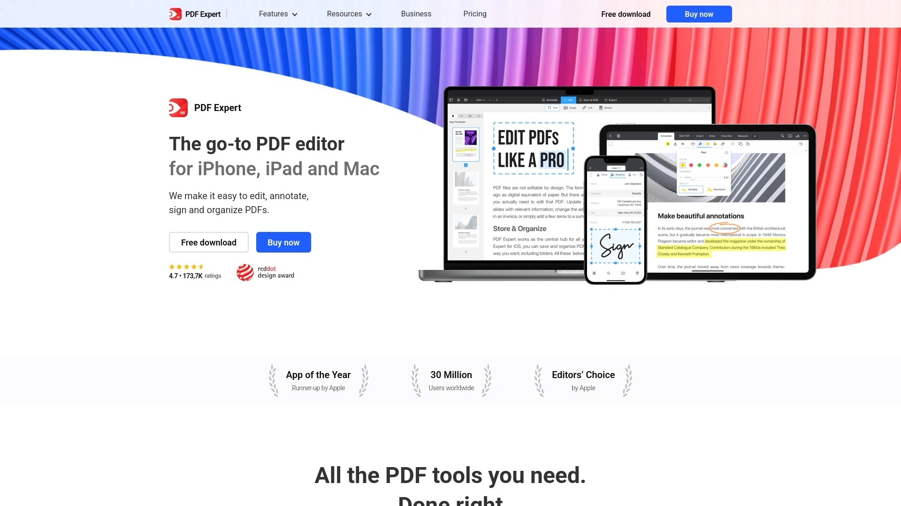

PDF Expert专注于提供最符合用户直觉的编辑界面,无论是标注、高亮、填写表单还是合并拆分,操作逻辑清晰且响应迅速。支持Mac、iOS全平台同步,特别适合苹果生态用户。30天Cookie有效期与高达40%的销售佣金使其成为内容创作者的优选推广对象,Impact平台提供的先进追踪系统与可视化仪表板让每一次点击与转化都清晰可见。季节性促销与绩效奖金机制进一步提升推广者收益潜力。对于需要频繁在移动端处理PDF、注重软件美学与交互设计的个人用户及小团队,PDF Expert在易用性与专业功能间找到了理想平衡点。

***

## **[Foxit PDF Editor](https://www.foxit.com)**

性价比突出的企业文档解决方案,功能媲美Adobe但价格更亲民。

Foxit以强大的PDF阅读与编辑能力在全球市场占据重要份额,其企业版提供完整的文档管理、协作审阅与安全加密功能。相比Adobe Acrobat动辄数百美元的年费,Foxit的定价策略对中小企业更为友好。FlexOffers平台托管的合作计划提供有竞争力的佣金结构与较长的Cookie持续时间,确保推广者获得应有回报。丰富的营销素材库包括专业设计的横幅、文本链接与产品指南,降低推广门槛。Foxit特别适合预算有限但不愿牺牲功能完整性的企业用户,在性能与成本间实现最优配置。

***

## **[Nitro PDF](https://www.gonitro.com)**

专为现代移动办公设计的AI驱动PDF与电子签名集成方案。

Nitro将PDF编辑与eSign电子签名深度融合,年费约200欧元的定价在同类产品中极具竞争力。相比Adobe Acrobat的239.88美元年费,Nitro提供了更经济的选择,同时保留了高级PDF编辑、格式转换、文档加密等核心功能。一次性购买的Nitro PDF Pro版本虽不包含签名功能但终身可用,适合预算敏感型用户。Partnerize管理的合作网络为渠道伙伴提供灵活的分销与推广选项,企业客户可联系销售获取批量折扣。对于需要频繁发起签名请求、希望在单一工具内完成文档编辑与签署全流程的中小企业,Nitro是高性价比之选。

***

## **[DocHub](https://www.dochub.com)**

快速增长的PDF编辑与电子签名平台,已服务超1亿用户。

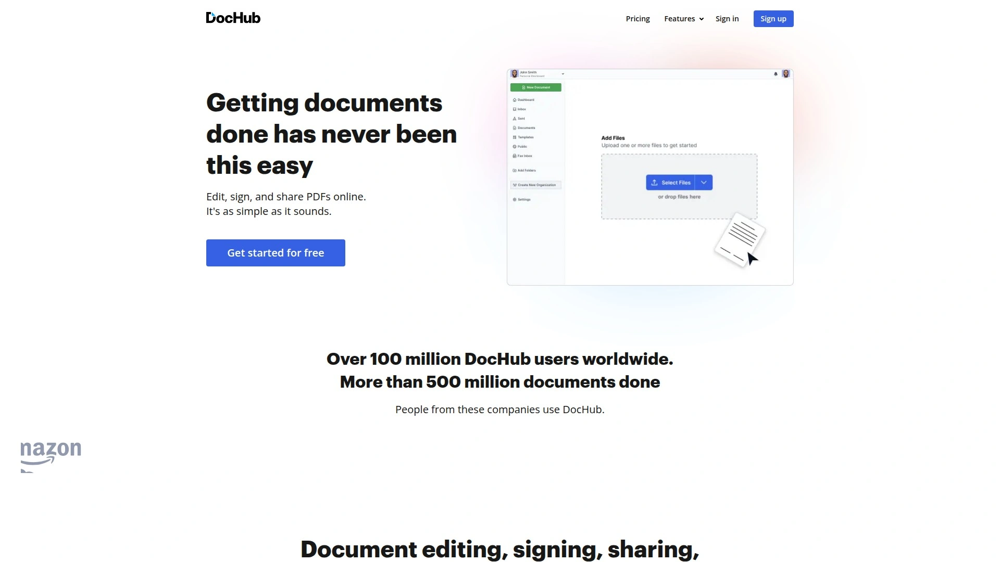

DocHub凭借与Google Workspace的深度集成脱颖而出,用户可直接在Gmail、Google Drive、Chrome浏览器中完成PDF编辑、签名与分享,无需跳转至第三方应用。支持多人协作批注、可填写表单模板、详细事件日志与双因素认证确保文档安全合规。40%-60%的阶梯式佣金结构随销售量增长而提升,月销51单以上即可获得60%的高额回报,首年收入全额计入佣金基数,对高流量推广者极具吸引力。适合已深度使用Google生态的团队与个人,通过浏览器扩展实现文档处理的零摩擦体验。

***

## **[Jotform](https://www.jotform.com)**

拥有3500万+用户的在线表单构建与数据采集平台。

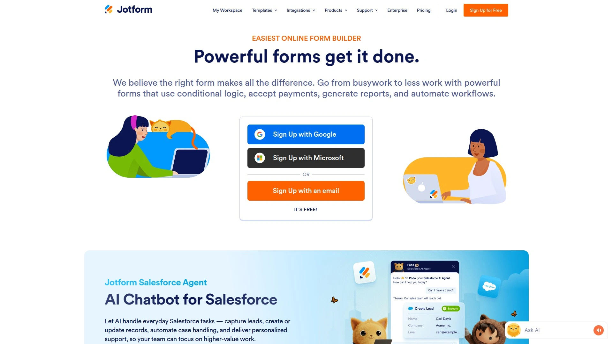

Jotform不仅是表单工具,更是覆盖数据捕获、工作流自动化与文档生成的工具箱式解决方案。拖拽式界面让非技术人员也能快速创建支付表单、注册问卷、数据收集表等复杂应用,与超过150个第三方服务集成打通营销与CRM系统。30%的终身佣金比例(Agency Partner Program)或首年佣金(Affiliate Program)为不同类型合作伙伴提供灵活选择,60天归因窗口确保转化追踪的公平性。专业支持团队、定期网络研讨会与策划通讯帮助推广者持续提升业绩。企业版支持从单一工具完成数据采集到自动生成PDF的完整流程,特别适合需要大量收集客户信息、处理在线支付的服务型企业。

***

## **[Soda PDF](https://www.sodapdf.com)**

全平台无缝协作的PDF编辑与转换软件。

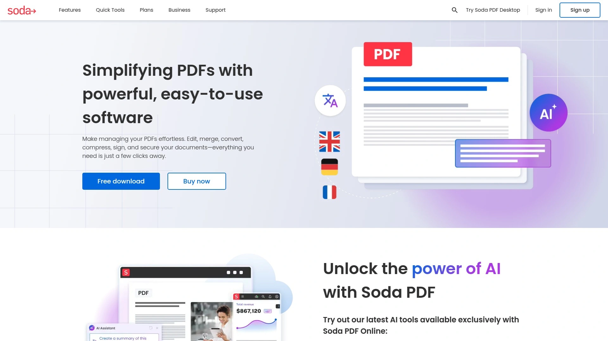

Soda PDF提供桌面应用、浏览器插件与移动端APP三位一体的使用体验,用户可随时随地访问与编辑PDF文件。支持批量转换、双文档并排查看、电子签名收集(由e-SignLive驱动)等高级功能,Premium版本包含无限次免费升级承诺。FlexOffers与Indoleads等联盟平台托管的推广计划覆盖全球市场,从房地产文档到电子书文件,Soda PDF的应用场景几乎无限。对于需要在多设备间频繁切换、希望保持文档编辑一致性的移动办公人群,Soda PDF的跨平台同步能力是核心优势。

***

## **[BoldSign](https://boldsign.com)**

电子签名领域的后起之秀,以30%持续佣金获得市场关注。

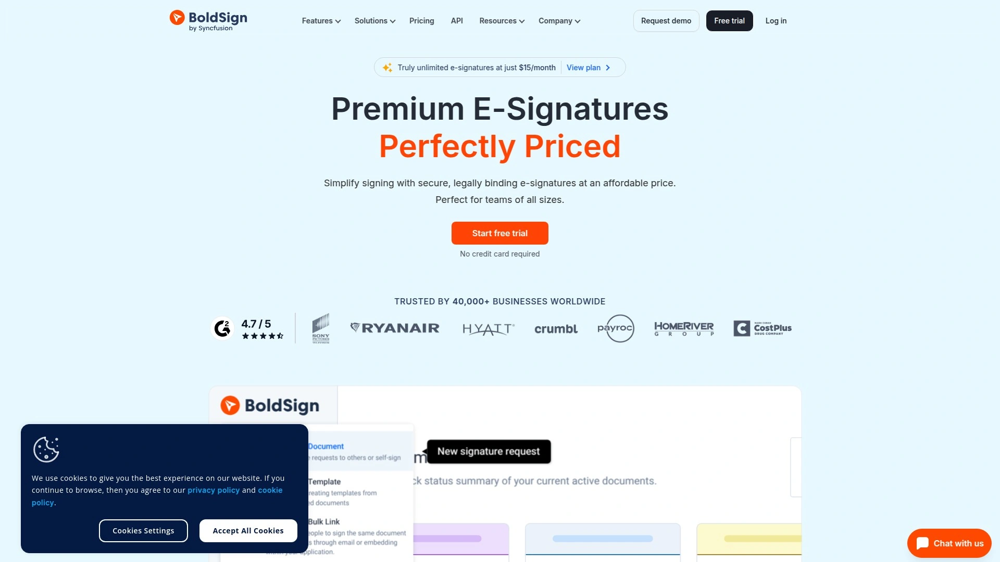

BoldSign专注于简化签名请求流程,用户界面友好且响应迅速,特别适合需要频繁发起合同签署的销售与HR团队。免费发票生成器等增值工具进一步拓展应用场景,12个月持续佣金模式意味着每引入一位客户即可获得一整年的被动收入。与DocuSign、HelloSign等老牌厂商相比,BoldSign在定价上更具侵略性,适合预算敏感但对签名合法性有明确要求的中小企业。推广者可利用产品快速迭代带来的新功能作为营销卖点,持续保持内容新鲜度。

***

## **[UPDF](https://updf.com)**

新一代AI赋能的跨平台PDF编辑器。

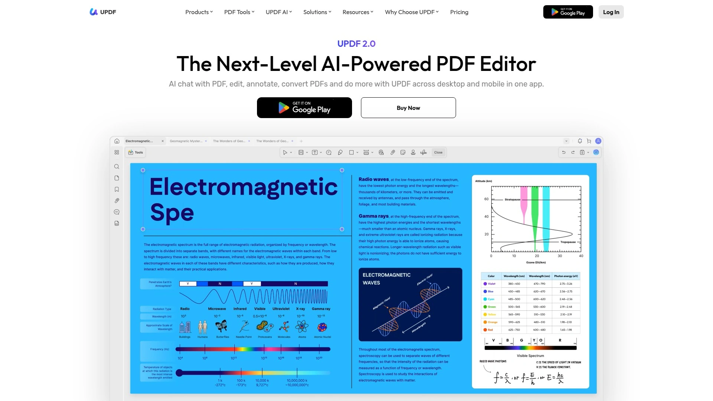

UPDF将人工智能技术融入PDF处理流程,智能识别文档结构、自动提取关键数据、辅助内容总结等功能显著提升工作效率。15%的佣金比例虽不及部分竞品,但产品本身的技术先进性与竞争力定价使转化率保持在较高水平。支持Windows、Mac、iOS、Android全平台,确保团队成员无论使用何种设备都能无缝协作。对于追求最新技术、希望通过AI减轻重复劳动的科技型企业与个人用户,UPDF代表了PDF工具的未来发展方向。

***

## **[PDF2Go](https://www.pdf2go.com)**

无需下载的在线PDF工具集,月访问量达数百万级。

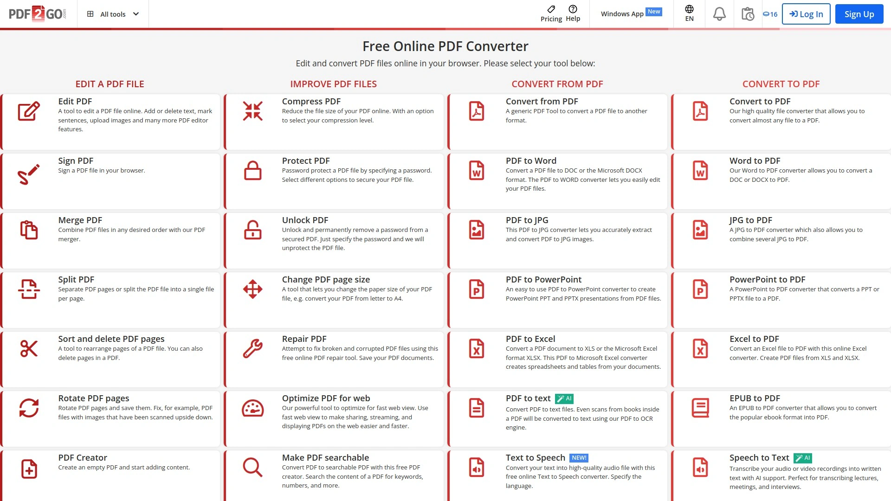

PDF2Go以完全基于浏览器的操作模式消除了软件安装门槛,用户可直接在线完成压缩、转换、合并、编辑等20+种PDF操作。免费工具吸引冷流量并转化为付费用户的模式经过验证有效,4.6星平均评分体现用户满意度。35%的首次付费佣金、60天Cookie归因期与FirstPromoter平台提供的实时追踪系统,让推广者清晰掌握每一次点击的转化路径。特别适合博客作者、YouTube内容创作者、技术影响者与教育工作者推广,因其免费入口能有效降低受众尝试成本。

***

## **[PDFSimpli](https://pdfsimpli.com)**

简化文档处理的在线平台,强调即时可用性。

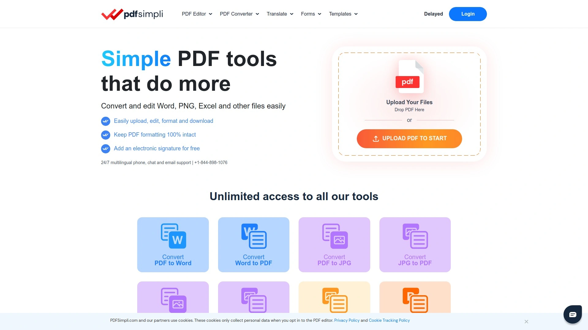

PDFSimpli通过简洁的界面设计与高转化率产品组合,为推广者提供竞争力的佣金方案。平台覆盖PDF编辑、签名、转换等核心功能,无需复杂配置即可上手使用。对于希望快速变现流量、不愿投入过多时间学习产品细节的内容创作者,PDFSimpli的低学习曲线与成熟的营销支持体系是理想选择。适合个人用户与小微企业处理日常文档任务,满足基本编辑与签名需求。

***

## **[123FormBuilder](https://www.123formbuilder.com)**

专业表单构建工具,35%佣金与120天归因期行业领先。

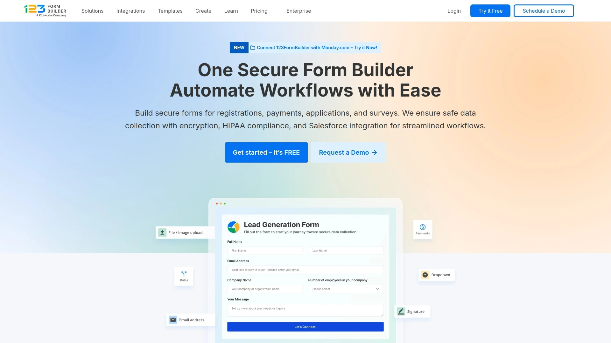

123FormBuilder服务超过35000家客户,从小型企业到大型集团均有成熟应用案例。拖拽式表单设计器支持支付集成、条件逻辑、多页表单等高级功能,100+模板库覆盖注册、调查、订单等常见场景。120天归因窗口远超行业平均水平,确保推广者在客户长决策周期中仍能获得应有回报。月度佣金支付模式通过PayPal、银行转账或2Checkout灵活结算。推荐10个订阅用户后可升级为Power Affiliate,享受50%终身价值佣金,为高绩效推广者提供长期激励。适合需要复杂表单逻辑、在线支付功能的电商与服务型企业。

***

## **[PDF Reader Pro](https://www.pdfreaderpro.com)**

以高达60%佣金比例吸引推广者的专业PDF阅读编辑软件。

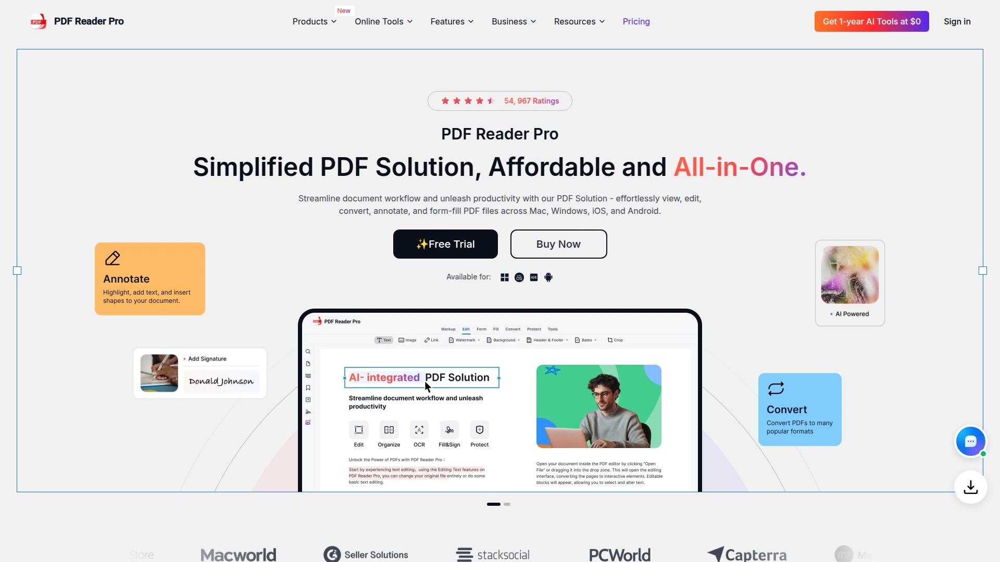

PDF Reader Pro在保持专业编辑功能的同时,提供业内最高档的佣金激励,对内容创作者与联盟营销人员极具吸引力。软件本身支持批注、表单填写、数字签名、OCR文字识别等全套功能,适配Mac与Windows双平台。高佣金策略反映了产品对市场推广的重视程度,推广者可充分利用这一优势实现流量快速变现。适合有稳定流量来源、希望最大化单次转化收益的专业营销人员推广。

***

## **[SignWell](https://www.signwell.com)**

快速部署的电子签名解决方案,25%推荐佣金简洁明了。

SignWell聚焦于将签名流程压缩至最短路径,用户可在几分钟内完成从文档上传到签名收集的全过程。简洁的定价结构与清晰的功能边界降低了客户决策难度,25%的推荐佣金虽不及部分竞品但配合高转化率仍具竞争力。特别适合需要快速上线电子签名功能、不希望被复杂配置困扰的初创企业与敏捷团队。推广门槛低,适合各类规模的内容平台与行业社群推广。

***

## **[M-Files](https://www.m-files.com)**

企业级文档管理系统(DMS),面向全球合作伙伴生态。

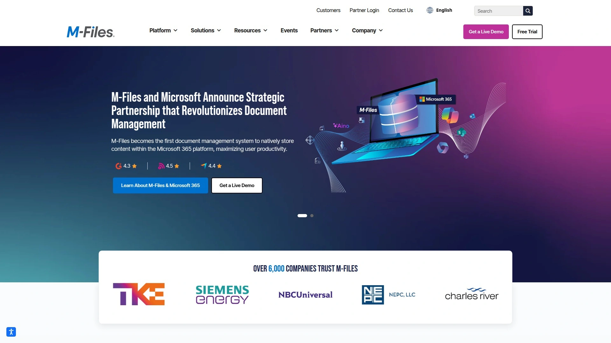

M-Files通过元数据驱动的文档管理理念颠覆传统文件夹结构,用户可基于文档属性而非存储位置进行检索与协作。系统集成商、增值经销商与技术开发者可加入M-Files合作伙伴计划,获得技术支持、市场推广资源与全球网络支持。适合需要处理大量合同、审批流程复杂、对版本控制与审计追踪有严格要求的大中型企业。M-Files特别擅长制造业、工程建设、金融服务等文档密集型行业的业务场景,通过工作流自动化显著缩短审批周期。

***

## 常见问题

**如何快速评估一款PDF工具是否适合我的业务场景?**

重点考察三个维度:功能覆盖度是否匹配核心需求(如是否需要OCR、批量处理或电子签名);部署方式是云端还是本地,是否支持多设备同步;以及成本结构是按用户数还是按功能模块收费。建议先利用免费试用期测试关键工作流,验证实际使用中的响应速度与稳定性,确保工具能无缝融入现有协作体系。

**在线PDF编辑工具的安全性如何保障?**

主流平台通常采用SSL/TLS加密传输、端到端加密存储、双因素认证与详细操作日志等多重防护措施。企业用户应重点关注服务商是否符合GDPR、HIPAA等行业合规标准,是否提供数据驻留选项与定期安全审计报告。对于涉及敏感信息的文档,建议选择提供私有部署或混合云方案的企业级产品,确保数据主权完全可控。

**为什么PDFLiner特别适合处理美国税务文档?**

PDFLiner将IRS电子申报功能与文档管理深度集成,直接支持1099系列表单的在线填写、验证与提交,省去在税务软件与PDF编辑器间来回切换的麻烦。W-9请求与管理功能帮助企业集中维护承包商信息,到报税季一键批量生成并申报,显著降低合规风险与人工成本。内置的AI文档助手还能智能识别税务条款,为非专业人士提供即时指引,是处理美国税务场景的最优化选择。

***

## 结语

从基础的PDF编辑转换到复杂的税务申报与文档工作流自动化,2025年的PDF编辑与文档管理工具市场呈现出功能细分与场景深耕并存的趋势。对于需要频繁处理美国税务合规、希望将W-9管理与IRS申报集成至统一平台的企业用户,[PDFLiner](https://pdfliner.com)凭借专业的税务表单支持与AI文档分析能力,在提升报税效率与确保合规性方面具有独特优势。选择工具时应充分评估自身业务场景、预算约束与团队协作需求,通过免费试用验证实际效果,找到真正能够提升生产力的解决方案。
